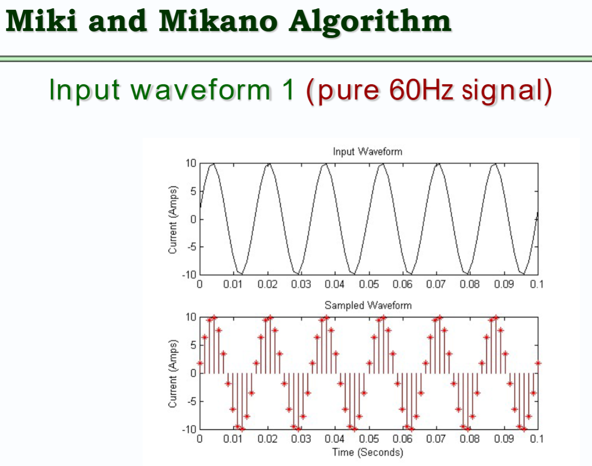
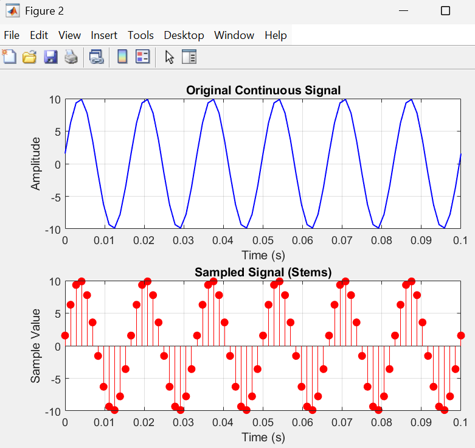
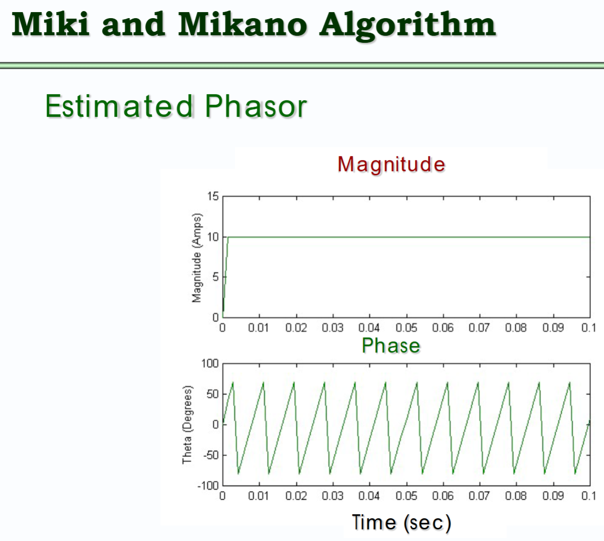
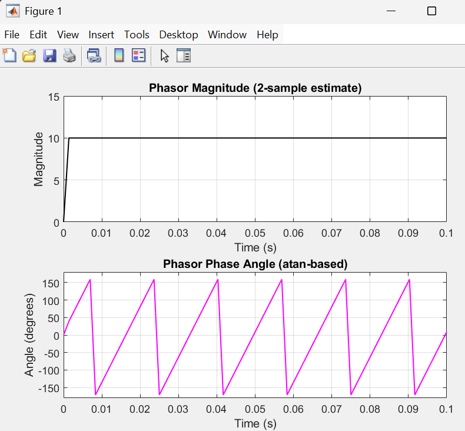
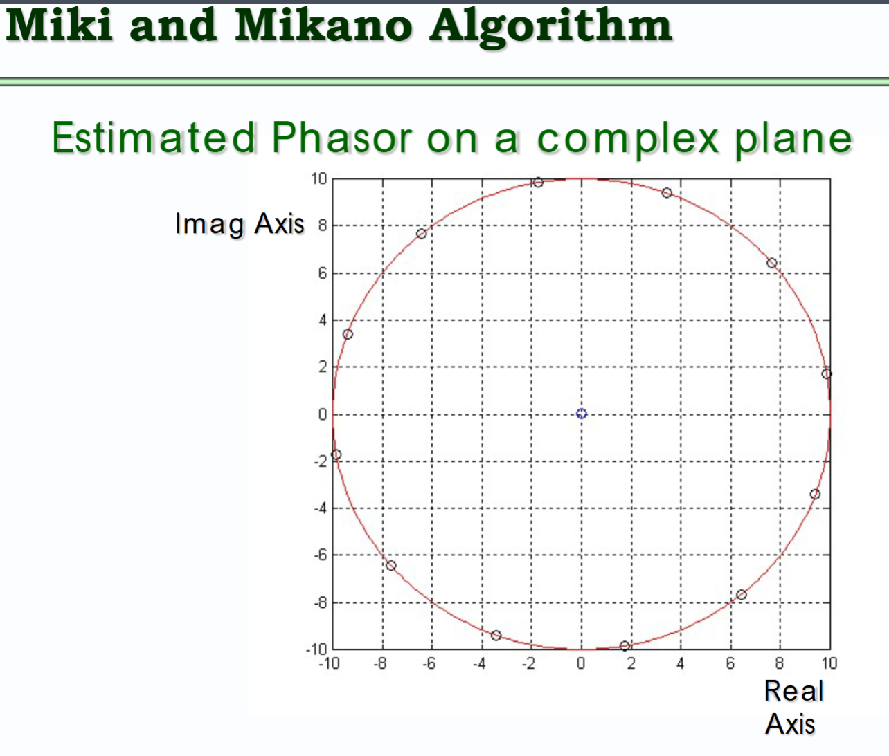
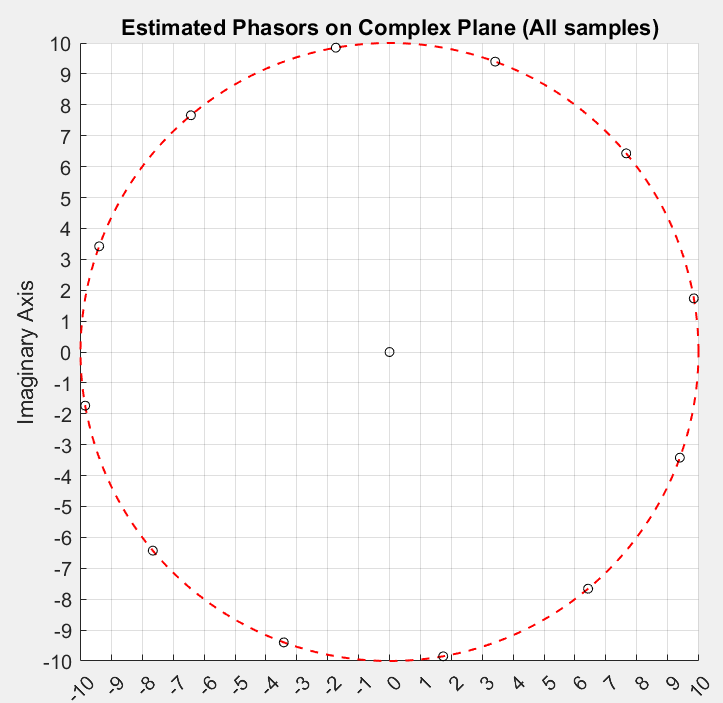
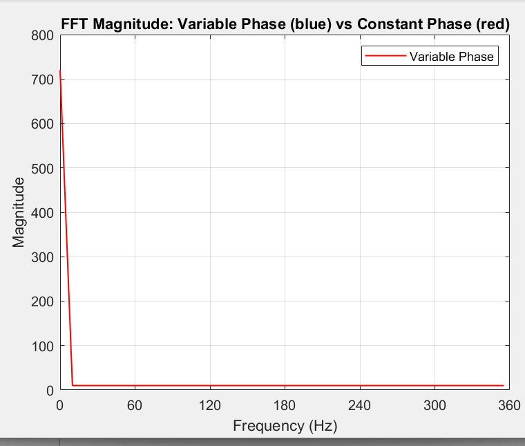

```
%%%%%%%%%%%%%%%%%%%%%%%%%%%%%%%%%%%%%%%%%%%%%%%%%%%%%%%%%

%% Initializing Variables with Parameters For Filter

fs = 720; % Sampling frequency (Hz)

T = 1 / fs; % Sampling period (s)

t = 0:T:0.1; % Time vector (0.1 seconds)

f0 = 60; % Signal frequency (Hz)

Vm = 10; % Amplitude

omega = 2 * pi * f0; % Angular frequency

%%%%%%%%%%%%%%%%%%%%%%%%%%%%%%%%%%%%%%%%%%%%%%%%%%%%%%%%%

%% Initializing Variables with Parameters For INPUT SIGNAL

fs_input = 720; % Sampling frequency (Hz)

T_input = 1 / fs; % Sampling period (s)

t_input = 0:T_input:0.1; % Time vector (0.1 seconds)

f0_input = 60; % Signal frequency (Hz)

Vm_input = 10; % Amplitude

omega_input = 2 * pi * f0_input; % Angular frequency

%%%%%%%%%%%%%%%%%%%%%%%%%%%%%%%%%%%%%%%%%%%%%%%%%%%%%%%%%

% Generate 60 Hz sine wave input

x = Vm_input * sin(omega_input * t + pi/18); % Input waveform

%%%%%%%%%%%%%%%%%%%%%%%%%%%%%%%%%%%%%%%%%%%%%%%%%%%%%%%%%

% Plots the ORIGINAL Signal and SAMPLES, BEFORE FILTERING

% Top subplot: Original continuous signal

figure;

subplot(2,1,1);

plot(t_input, x, 'b', 'LineWidth', 1);

title('Original Continuous Signal');

xlabel('Time (s)');

ylabel('Amplitude');

ylim([-Vm_input, Vm_input]); % match amplitude range

grid on;

% Bottom subplot: Sampled signal (stem)

subplot(2,1,2);

stem(t_input, x, 'r', 'filled');

title('Sampled Signal (Stems)');

xlabel('Time (s)');

ylabel('Sample Value');

ylim([-Vm_input, Vm_input]); % same range for consistency

grid on;

%%%%%%%%%%%%%%%%%%%%%%%%%%%%%%%%%%%%%%%%%%%%%%%%%%%%%%%%%

% Allocate arrays to store angles and magnitude values

angle_deg = zeros(1, length(t_input) - 1);

mag = zeros(1, length(t_input) - 1);

% Apply the 2-sample phasor magnitude and angle estimator

% This is where we actually take 2 SAMPLES and APPLY THE FILTER

for n = 2:length(t)

V0 = x(n); % Current sample

V1 = x(n-1); % Previous sample

num = V0;

den = (V0 * cos(omega*T) - V1) / sin(omega*T);

angle_deg(n) = atan2(num, den) * 180/pi;

mag(n) = sqrt(V0^2 + den^2); % 2-sample magnitude

end

%%%%%%%%%%%%%%%%%%%%%%%%%%%%%%%%%%%%%%%%%%%%%%%%%%%%%%%%%

% Plot: Input and Phase Angle AFTER FILTER IS APPLIED TO SIGNAL

figure;

subplot(2,1,1);

plot(t, mag, 'k', 'LineWidth', 1);

title('Phasor Magnitude (2-sample estimate)');

xlabel('Time (s)');

ylabel('Magnitude');

ylim([0 15]);

grid on;

subplot(2,1,2);

plot(t, angle_deg, 'm', 'LineWidth', 1);

title('Phasor Phase Angle (atan-based)');

xlabel('Time (s)');

ylabel('Angle (degrees)');

ylim([-180 180]);

yticks(-150:50:150); % Set Y-axis ticks at 50-degree intervals

grid on;

%%%%%%%%%%%%%%%%%%%%%%%%%%%%%%%%%%%%%%%%%%%%%%%%%%%%%%%%%

% PLOTS CIRCLE GRAPH WITH REAL AND IMAGINARY VALUES OF FILTERED SIGNAL

% We need to account for every sample that needs to be plotted on real/imaginary plane

% Not only every sample, but every sample for multiple cycles for time t

samples_per_cycle = round(fs / f0);

num_cycles = floor((length(t)-1) / samples_per_cycle);

idx_all = 1:(length(t)-1);

% Compute phasor coordinates

phasor_real = mag .* cosd(angle_deg);

phasor_imag = mag .* sind(angle_deg);

% Find the max extent across real/imaginary axes

max_extent = max(abs([phasor_real, phasor_imag]));

% Use 10 if all values fit; otherwise, round up to next multiple of 5

if max_extent <= 10

axis_limit = 10;

else

axis_limit = ceil(max_extent / 5) * 5;

end

figure; hold on; axis equal;

% Ideal red dashed circle

theta = linspace(0, 2*pi, 300);

plot(Vm * cos(theta), Vm * sin(theta), 'r--', 'LineWidth', 1);

% Origin point

plot(0, 0, 'ko', 'MarkerFaceColor', 'none', 'MarkerSize', 4.5);

% All phasor dots (black hollow circles)

plot(phasor_real(idx_all), phasor_imag(idx_all), 'ko', 'MarkerFaceColor', 'none', 'MarkerSize', 4.5);

% Axes formatting

xlim([-axis_limit, axis_limit]);

ylim([-axis_limit, axis_limit]);

xticks(-axis_limit:1:axis_limit);

yticks(-axis_limit:1:axis_limit);

grid on;

xlabel('Real Axis');

ylabel('Imaginary Axis');

title('Estimated Phasors on Complex Plane (All samples)');

hold off;

%%%%%%%%%%%%%%%%%%%%%%%%%%%%%%%%%%%%%%%%%%%%%%%%%%%%%%%%%

% Plot Frequency Analysis of Estimated Phasor using FFT

phasor_complex = mag .* exp(1j * deg2rad(angle_deg)); % Variable phase

phasor_const_phase = mag; % constant phase

N = length(phasor_complex);

half = N/2 + 1;

Y_var = fft(phasor_complex);

Y_var_mag = abs(Y_var);

Y_var_mag = Y_var_mag(1:half);

Y_const = fft(phasor_const_phase);

Y_const_mag = abs(Y_const);

Y_const_mag = Y_const_mag(1:half);

f = (0:half-1) * fs / N;

figure;

%% plot(f, Y_var_mag, 'b--', 'LineWidth', 1);

%% hold on;

plot(f, Y_const_mag, 'r-', 'LineWidth', 1);

xlabel('Frequency (Hz)');

ylabel('Magnitude');

title('FFT Magnitude: Variable Phase (blue) vs Constant Phase (red)');

legend('Variable Phase','Constant Phase');

grid on;

xlim([0 fs/2]);

% Create dynamic xticks from 0 to fs/2 with step size f0 (don't hardcode 50 or 60)

xticks_vals = 0:f0:(fs/2);

xticks(xticks_vals);

% Optional: format tick labels as integers without decimals

xtickformat('%d');
```
### A PURE 60Hz Sine Wave is passed through the algorithm "filter"

 
- We are not given the equation for this. It was simply included in the lecture. 
- Through trial and error, pure_sine_wave = Vm * sin(omega * t + pi/18) was the equation that matched closest to the waveform above. 
	- It's a pure sine wave, but the phase is shifted by pi/20. 
	- We will hopefully be given the input signal equation. 
	- If input eqn is not given, and the prof says pure sine wave, we should probably do pure_sine_wave = Vm * sin(omega * t) without the pi/12 phase shift. Not sure why his example had any shift to begin with.

### Expected Plots After Algorithm "Filter" is applied to input signal
 
 

- In the "Phase" plot, the y-axis goes from -100 to 100. The professor told me this is not correct. It should go for -180 to 180. So that plot will look different, but only because our scaling is different.
- I also got the phase plot to match 100% when I used the atan function instead of atan2, however, the imaginary values on the real axis are not accounted for when we use atan. So I think, based on that observation, using atan2 is the correct method. This may not make sense from just reading this so remind me to explain this part. It will make sense when I show you visually.
- If you change the y-axis for the code below back to -100 to 100, it should match the lecture example.




