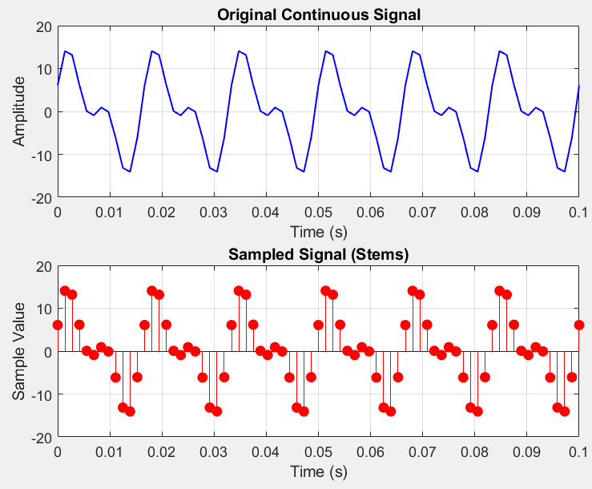
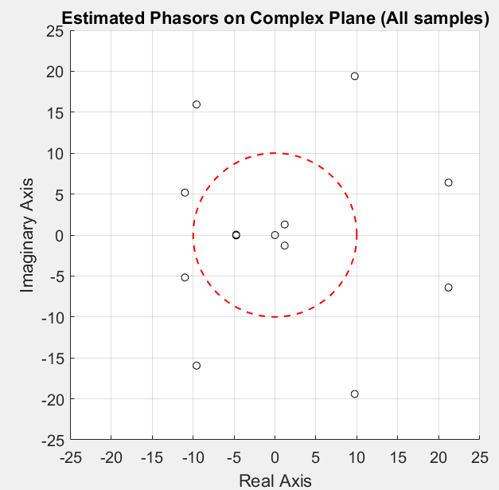
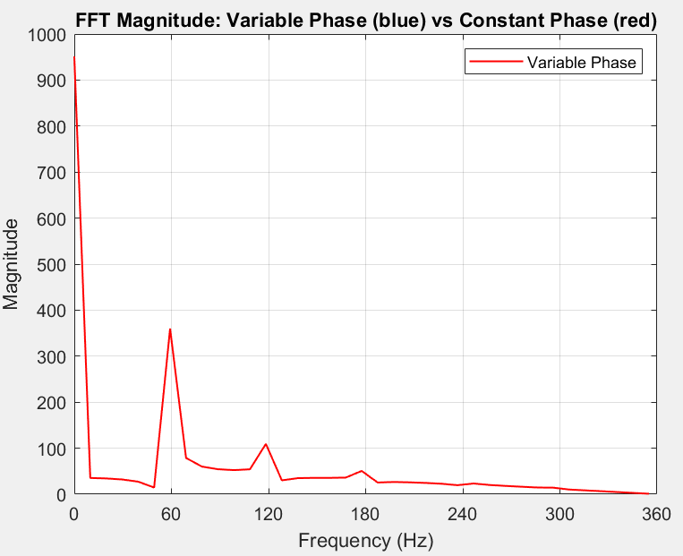

```
%%%%%%%%%%%%%%%%%%%%%%%%%%%%%%%%%%%%%%%%%%%%%%%%%%%%%%%%%

%% Initializing Variables with Parameters

fs = 720; % Sampling frequency (Hz)

T = 1 / fs; % Sampling period (s)

t = 0:T:0.1; % Time vector (0.1 seconds)

f0 = 60; % Fundamental frequency (Hz)

Vm = 10; % Fundamental amplitude

omega = 2 * pi * f0; % Angular frequency of fundamental

%%%%%%%%%%%%%%%%%%%%%%%%%%%%%%%%%%%%%%%%%%%%%%%%%%%%%%%%%

%% Initializing Variables with Parameters For INPUT SIGNAL

fs_input = 720; % Sampling frequency (Hz)

T_input = 1 / fs; % Sampling period (s)

t_input = 0:T_input:0.1; % Time vector (0.1 seconds)

f0_input = 60; % Signal frequency (Hz)

Vm_input = 10; % Input Amplitude

A = 7; % Amplitude of 2nd harmonic (example: 3V)

omega_input = 2 * pi * f0_input; % Angular frequency

%%%%%%%%%%%%%%%%%%%%%%%%%%%%%%%%%%%%%%%%%%%%%%%%%%%%%%%%%

% Generate 60 Hz sine wave input with 2nd harmonic at 120 Hz

x = Vm_input * sin(omega_input * t_input + pi/12) + A * sin(2 * omega_input * t_input + pi/6); % Composite waveform

% Allocate arrays to store angles and magnitude values

angle_deg = zeros(1, length(t_input)-1);

mag = zeros(1, length(t_input)-1);

%%%%%%%%%%%%%%%%%%%%%%%%%%%%%%%%%%%%%%%%%%%%%%%%%%%%%%%%%

% Plots the ORIGINAL Signal and SAMPLES, BEFORE FILTERING

% Top subplot: Original continuous signal

figure;

subplot(2,1,1);

plot(t, x, 'b', 'LineWidth', 1);

title('Original Continuous Signal');

xlabel('Time (s)');

ylabel('Amplitude');

ylim([-Vm - 10, Vm + 10]); % match amplitude range

grid on;

% Bottom subplot: Sampled signal (stem)

subplot(2,1,2);

stem(t, x, 'r', 'filled');

title('Sampled Signal (Stems)');

xlabel('Time (s)');

ylabel('Sample Value');

ylim([-Vm - 10, Vm + 10]); % same range for consistency

grid on;

%%%%%%%%%%%%%%%%%%%%%%%%%%%%%%%%%%%%%%%%%%%%%%%%%%%%%%%%%

% Apply the 3-sample phasor magnitude and angle estimator

% This is where we actually take 3 SAMPLES and APPLY THE FILTER

for n = 3:length(t)

V_minus_1 = x(n-2); % x[n-2]

V0 = x(n-1); % x[n-1] → center sample

V_plus_1 = x(n); % x[n]

% Phasor magnitude (squared), then square root

mag_num = (V0^2 - V_plus_1 * V_minus_1);

mag_den = (sin(omega * T)^2);

ang_num = 2 * V0 * sin(omega * T);

ang_den = V_plus_1 - V_minus_1;

mag(n - 1) = sqrt(mag_num/mag_den);

angle_deg(n - 1) = atan2(ang_num, ang_den) * 180 / pi;

end

%%%%%%%%%%%%%%%%%%%%%%%%%%%%%%%%%%%%%%%%%%%%%%%%%%%%%%%%%

% Pad to align with time vector

% Professors plots start at 0, so I'm zero padding the magnitude and phase.

% Without this code, the plot does not start at zero.

angle_deg = [angle_deg(1), angle_deg];

mag = [0, mag]; % Start magnitude at zero

angle_deg(1) = 0; % Set the initial angle to 0 so that it doesn't start randomly on the y axis

%%%%%%%%%%%%%%%%%%%%%%%%%%%%%%%%%%%%%%%%%%%%%%%%%%%%%%%%%

% Plot: Input and Phase Angle AFTER FILTER IS APPLIED TO SIGNAL

figure;

subplot(2,1,1);

plot(t, mag, 'k', 'LineWidth', 1);

title('Phasor Magnitude (3-sample estimate)');

xlabel('Time (s)');

ylabel('Magnitude');

ylim([0 25]);

grid on;

subplot(2,1,2);

plot(t, angle_deg, 'm', 'LineWidth', 1);

title('Phasor Phase Angle (atan-based)');

xlabel('Time (s)');

ylabel('Angle (degrees)');

ylim([-180 180]);

yticks(-150:50:150); % Set Y-axis ticks at 50-degree intervals

grid on;

%%%%%%%%%%%%%%%%%%%%%%%%%%%%%%%%%%%%%%%%%%%%%%%%%%%%%%%%%

% PLOTS CIRCLE GRAPH WITH REAL AND IMAGINARY VALUES OF FILTERED SIGNAL

% We need to account for every sample that needs to be plotted on real/imaginary plane

% Not only every sample, but every sample for multiple cycles for time t

samples_per_cycle = round(fs / f0);

num_cycles = floor((length(t)-1) / samples_per_cycle);

idx_all = 1:(length(t)-1);

% Compute phasor coordinates

phasor_real = mag .* cosd(angle_deg);

phasor_imag = mag .* sind(angle_deg);

% Find the max extent across real/imaginary axes

max_extent = max(abs([phasor_real, phasor_imag]));

% Use 10 if all values fit; otherwise, round up to next multiple of 5

if max_extent <= 10

axis_limit = 10;

else

axis_limit = ceil(max_extent / 5) * 5;

end

figure; hold on; axis equal;

% Ideal red dashed circle

theta = linspace(0, 2*pi, 300);

plot(Vm * cos(theta), Vm * sin(theta), 'r--', 'LineWidth', 1);

% Origin point

plot(0, 0, 'ko', 'MarkerFaceColor', 'none', 'MarkerSize', 4.5);

% All phasor dots (black hollow circles)

plot(phasor_real(idx_all), phasor_imag(idx_all), 'ko', 'MarkerFaceColor', 'none', 'MarkerSize', 4.5);

% Axes formatting

xlim([-axis_limit, axis_limit]);

ylim([-axis_limit, axis_limit]);

xticks(-axis_limit:5:axis_limit);

yticks(-axis_limit:5:axis_limit);

grid on;

xlabel('Real Axis');

ylabel('Imaginary Axis');

title('Estimated Phasors on Complex Plane (All samples)');

hold off;

%%%%%%%%%%%%%%%%%%%%%%%%%%%%%%%%%%%%%%%%%%%%%%%%%%%%%%%%%

% Plot Frequency Analysis of Estimated Phasor using FFT

phasor_complex = mag .* exp(1j * deg2rad(angle_deg)); % Variable phase

phasor_const_phase = mag; % constant phase

N = length(phasor_complex);

half = N/2 + 1;

Y_var = fft(phasor_complex);

Y_var_mag = abs(Y_var);

Y_var_mag = Y_var_mag(1:half);

Y_const = fft(phasor_const_phase);

Y_const_mag = abs(Y_const);

Y_const_mag = Y_const_mag(1:half);

f = (0:half-1) * fs / N;

figure;

%% plot(f, Y_var_mag, 'b--', 'LineWidth', 1);

%% hold on;

plot(f, Y_const_mag, 'r-', 'LineWidth', 1);

xlabel('Frequency (Hz)');

ylabel('Magnitude');

title('FFT Magnitude: Variable Phase (blue) vs Constant Phase (red)');

legend('Variable Phase','Constant Phase');

grid on;

xlim([0 fs/2]);

% Create dynamic xticks from 0 to fs/2 with step size f0 (don't hardcode 50 or 60)

xticks_vals = 0:f0:(fs/2);

xticks(xticks_vals);

% Optional: format tick labels as integers without decimals

xtickformat('%d');
```






